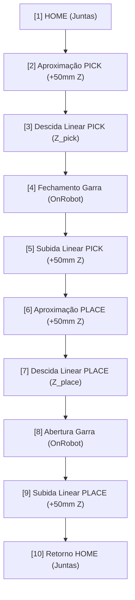

# Descritivo de Processo e Movimentação Cinemática do UR3

Este documento descreve detalhadamente o funcionamento lógico do Jogo da Velha, os algoritmos envolvidos (Visão e Minimax) e os movimentos cinemáticos precisos realizados pelo braço robótico UR3 durante cada jogada.

---

## 1. Funcionamento Geral do Sistema

O sistema opera como uma malha fechada baseada em eventos (Event-Driven):

```
 ┌──────────────┐      ┌────────────────┐      ┌─────────────────┐      ┌─────────────┐
 │  Câmera USB  │ ───▶ │ Detector (CV2) │ ───▶ │   GameManager   │ ───▶ │  Robô UR3   │
 │   Captura    │      │  Valida Peça   │      │ Minimax e State │      │ Movimentação│
 └──────────────┘      └────────────────┘      └────────┬────────┘      └─────────────┘
        ▲                                               │
        └─────────────────── Exibe Feed ────────────────┘
```

1. **Visão Computacional:** Captura frames brutos, retifica a perspectiva (Homografia) e filtra por cores no espaço HSV para reconhecer peças do jogador (Azul) e do robô (Laranja) na grade virtualizada.
2. **Máquina de Estados (Game Manager):** Mantém o estado lógico do tabuleiro (`Array[9]`). Quando o jogador joga, ele valida o movimento e chama a IA.
3. **Tomada de Decisão (IA Minimax):** Calcula a melhor jogada usando busca em árvore com poda Alpha-Beta para maximizar a chance de vitória do robô (O).
4. **Cinemática do Robô:** Gera o script em linguagem nativa **URScript** detalhando todas as posições cartesianas e comandos de garra e envia via rede ao UR3.

---

## 2. A Sequência de Movimentos do Robô (10 Passos)

Para garantir segurança total, evitar colisões e otimizar o tempo de ciclo, a trajetória cartesiana do UR3 para posicionar uma peça segue uma sequência estruturada em **10 passos**:



### Detalhamento Cartesiano e Cinemático dos Passos:

#### Passo 1 — HOME
* **Tipo de movimento:** `movej` (espaço de junta).
* **Função:** Garante que o robô comece em uma posição segura e conhecida, evitando singularidades cinemáticas. Os ângulos das juntas são enviados em radianos: `[-1.5708, -1.5708, -1.5708, -1.5708, 1.5708, 0.0]`.

#### Passo 2 — Aproximação do PICK (Z + Offset)
* **Tipo de movimento:** `movel` (movimento linear cartesiano).
* **Posição do TCP:** `p[x_pick, y_pick, z_pick + 0.050, rx, ry, rz]`.
* **Função:** Move o cabeçote até ficar exatamente 50 mm acima do estoque de peças para evitar choques horizontais. É usado um raio de mistura (`blend_radius = 0.01` m) para suavizar a transição.

#### Passo 3 — Descida Linear do PICK (Captura)
* **Tipo de movimento:** `movel` em velocidade lenta (`0.12 m/s`).
* **Posição do TCP:** `p[x_pick, y_pick, z_pick, rx, ry, rz]`.
* **Função:** Desce o braço robótico em linha reta vertical (eixo Z) até a altura exata de contato com a peça no estoque.

#### Passo 4 — Fechamento da Garra OnRobot
* **Comando URScript:** `rg_grip(force=20, width=25, depth_compensation=False, slave=False)` seguido por `sleep(1.0)`.
* **Função:** Envia sinal digital para fechar a garra OnRobot RG2 com força de 20 Newtons até uma largura de 25 mm, prendendo firmemente a peça. Aguarda 1 segundo para garantir o aperto antes de levantar.

#### Passo 5 — Subida Linear do PICK
* **Tipo de movimento:** `movel`.
* **Posição do TCP:** `p[x_pick, y_pick, z_pick + 0.050, rx, ry, rz]`.
* **Função:** Levanta a peça em linha reta vertical para fora do estoque, evitando colisões com outras peças adjacentes.

#### Passo 6 — Aproximação do PLACE (Destino + Offset)
* **Tipo de movimento:** `movel` em velocidade rápida (`0.3 m/s`).
* **Posição do TCP:** `p[x_cell, y_cell, z_place + 0.050, rx, ry, rz]`.
* **Função:** Translada a peça capturada horizontalmente até a projeção vertical 50 mm acima da célula de destino (0 a 8) calculada pela IA.

#### Passo 7 — Descida Linear do PLACE (Entrega)
* **Tipo de movimento:** `movel` em velocidade lenta.
* **Posição do TCP:** `p[x_cell, y_cell, z_place, rx, ry, rz]`.
* **Função:** Desce verticalmente com precisão até que a peça toque a superfície do tabuleiro.

#### Passo 8 — Abertura da Garra OnRobot
* **Comando URScript:** `rg_grip(force=20, width=100, depth_compensation=False, slave=False)` seguido por `sleep(1.0)`.
* **Função:** Abre a garra até a largura de 100 mm para soltar completamente a peça no tabuleiro.

#### Passo 9 — Subida Linear do PLACE
* **Tipo de movimento:** `movel`.
* **Posição do TCP:** `p[x_cell, y_cell, z_place + 0.050, rx, ry, rz]`.
* **Função:** Levanta a garra vazia verticalmente para se afastar da peça e do tabuleiro.

#### Passo 10 — Retorno HOME
* **Tipo de movimento:** `movej`.
* **Função:** Retorna o robô de forma limpa para a pose HOME inicial, desimpedindo a visualização da câmera para o próximo turno do jogador.

---

## 3. Algoritmo de Visão Computacional

A classe `PieceDetector` captura a imagem da câmera USB e extrai o tabuleiro:
1. **Homografia:** Transforma a perspectiva inclinada da câmera em uma imagem de grade perfeitamente plana.
2. **Espaço de Cor HSV:** Converte a imagem de RGB para HSV (Matiz, Saturação, Valor) para maior tolerância a variações de luz.
3. **Filtros HSV:**
   * **Jogador (Azul):** `H: 100-130 | S: 80-255 | V: 80-255`.
   * **Robô (Laranja):** `H: 5-20 | S: 100-255 | V: 100-255`.
4. **Morfologia:** Aplica operações matemáticas (`MORPH_OPEN` e `MORPH_CLOSE`) para eliminar ruídos de pixels isolados.
5. **Enquadramento de Células:** Divide a matriz da imagem do tabuleiro em uma matriz 3x3 e conta os pixels ativos. Se o filtro de pixels azuis passar de um limite de área por 8 frames consecutivos, uma nova jogada do jogador é confirmada na célula correspondente.

---

## 4. Algoritmo de Inteligência Artificial (Minimax)

A tomada de decisão lógica do robô é alimentada por um algoritmo Minimax clássico com otimização:
* **Árvore de Busca:** Simula todas as jogadas futuras possíveis na partida recursivamente.
* **Poda Alpha-Beta:** Descarta ramos da árvore de decisão que são comprovadamente piores que escolhas anteriores, reduzindo drasticamente o processamento do Raspberry Pi 3B+.
* **Heurística de Pontuação:**
  * Vitória do Robô (`O`): `+10` pontos menos a profundidade da busca (incentiva vencer rápido).
  * Vitória do Humano (`X`): `-10` pontos mais a profundidade (incentiva atrasar a derrota).
  * Empate: `0` pontos.
* **Critério de Desempate (Prioridade de Posição):** Se várias jogadas apresentarem a mesma pontuação ideal, o algoritmo prioriza o **centro (célula 4)**, seguido pelos **cantos (0, 2, 6, 8)** e por fim as **bordas (1, 3, 5, 7)**.
